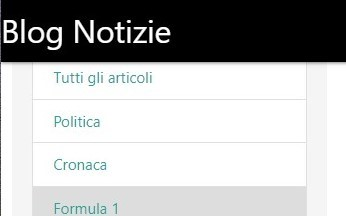
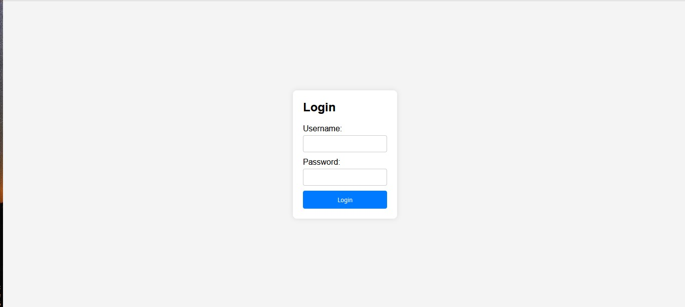
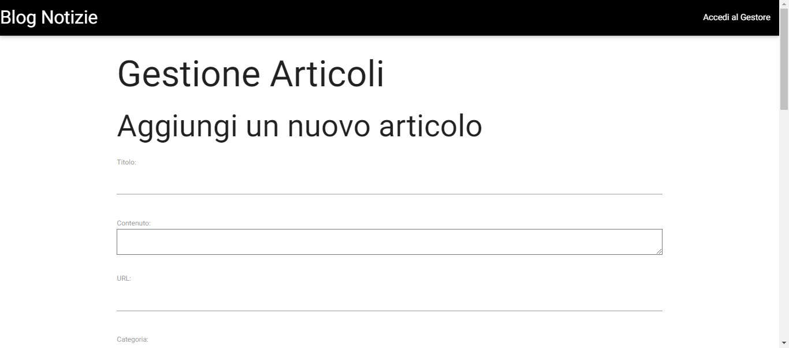
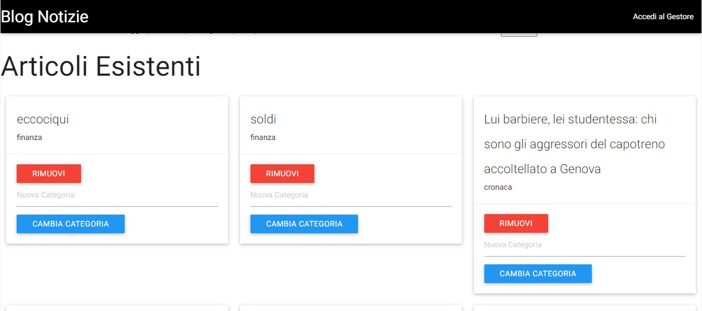
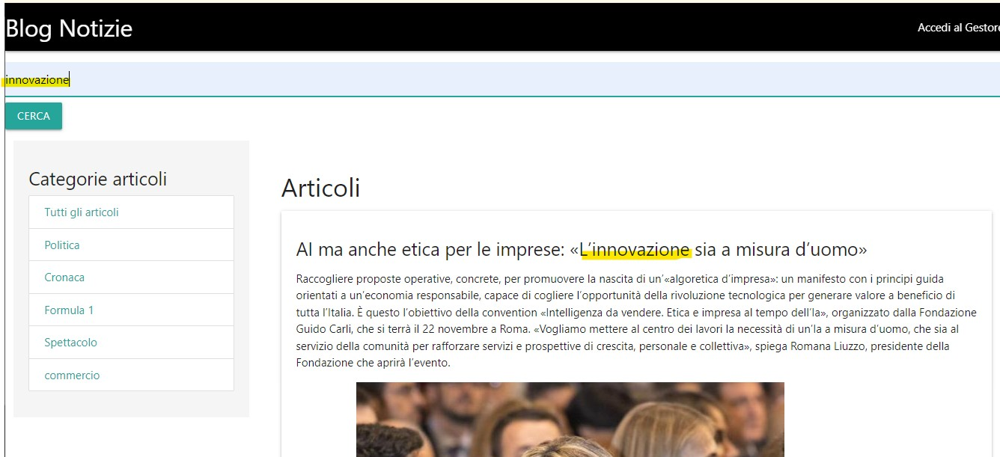
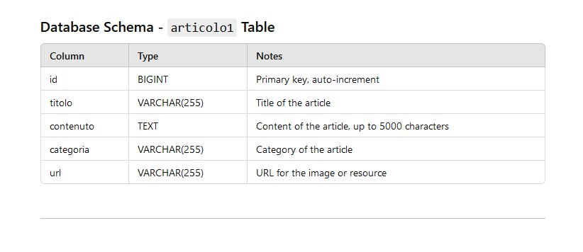
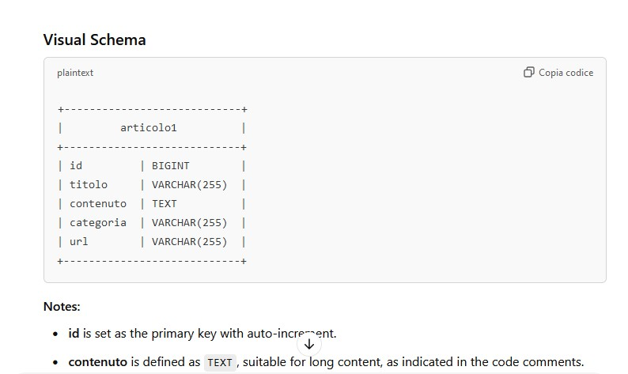

# Blog with Search and Login

 <!-- Logo o immagine principale del progetto -->

## Project Overview

The **Blog with Search and Login** project is a web application built with **Spring Boot**. It allows administrators to manage articles, including creating, editing, and deleting articles. The app is secured with login functionality and features a dynamic category-based sidebar and a search bar for users to filter articles.

## Technologies Used

- **Spring Boot** - For creating the backend and managing the entire application lifecycle.
- **Spring Security** - For securing the admin panel with authentication.
- **Thymeleaf** - For dynamic HTML templating.
- **JPA (Java Persistence API)** - For managing the persistence of articles in a MySQL database.
- **Materialize CSS** - For the responsive and modern frontend design.
- **MySQL** - For storing articles, user information, and categories.

## Features

### Login Page
The admin panel is protected by a login system that requires a valid username and password. Only authenticated users with the appropriate credentials can access the panel.

### Admin Panel - Article Management
Administrators can add, modify, and delete articles. Each article includes a title, content, image, and category.

### Article Display
On the user-facing side, articles are displayed dynamically, organized by categories. Users can click on a category in the sidebar to filter articles.

### Search Functionality
The application includes a search form that allows users to search articles by keyword.

## Database Structure
The application uses a MySQL database to store articles and categories. Articles are linked to categories, allowing users to filter articles by their respective category.

---

### Footer

&copy; 2024 Blog with Search and Login. Giuseppe Denora  All rights reserved.
